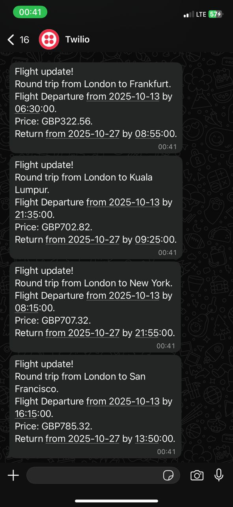

# ✈️ Cheapest Flight Search & Alert System

A Python-based flight monitoring application that automatically searches for the cheapest round-trip flights from London to various destinations and sends real-time WhatsApp notifications when deals are found.

## 📋 Table of Contents

- [Overview](#overview)
- [Features](#features)
- [How It Works](#how-it-works)
- [Prerequisites](#prerequisites)
- [Installation](#installation)
- [Configuration](#configuration)
- [Usage](#usage)
- [Project Structure](#project-structure)
- [API Documentation](#api-documentation)
- [Results](#results)
- [Future Enhancements](#future-enhancements)
- [Troubleshooting](#troubleshooting)
- [Contributing](#contributing)
- [License](#license)

## 🎯 Overview

This application monitors flight prices from London to multiple destinations stored in a Google Sheet (via SheetDB). It uses the Amadeus Flight API to fetch real-time pricing data and automatically sends WhatsApp notifications via Twilio when affordable flight options are available.

**Perfect for:**
- Budget travelers looking for flight deals
- Travel enthusiasts who want automated price monitoring
- Anyone planning trips to multiple destinations

## ✨ Features

- **Automated IATA Code Lookup**: Automatically retrieves and stores airport codes for cities
- **Real-time Flight Price Monitoring**: Searches for the cheapest round-trip flights within a 14-day window
- **Smart Price Comparison**: Compares current prices against historical lowest prices
- **WhatsApp Notifications**: Sends instant alerts with flight details including:
  - Departure and return dates/times
  - Flight prices in GBP
  - Destination information
- **Google Sheets Integration**: Stores and manages destination data in a cloud spreadsheet
- **Flexible Date Search**: Automatically searches flights departing tomorrow with 14-day stays

## 🔄 How It Works

1. **Data Retrieval**: Fetches destination cities and target prices from Google Sheet via SheetDB API
2. **IATA Code Resolution**: Converts city names to standard airport codes using Amadeus Cities API
3. **Flight Search**: Queries Amadeus Flight API for the cheapest round-trip flights from London
4. **Price Analysis**: Compares found flights against historical lowest prices
5. **Notification**: Sends WhatsApp messages via Twilio for viable flight options

## 📦 Prerequisites

Before you begin, ensure you have the following:

- **Python 3.8+** installed on your system
- **API Accounts**:
  - [Amadeus for Developers](https://developers.amadeus.com/) (Free tier available)
  - [SheetDB](https://sheetdb.io/) account with a configured Google Sheet
  - [Twilio](https://www.twilio.com/) account with WhatsApp sandbox enabled
- **Google Sheet** with the following columns:
  - `City`: Destination city name
  - `IATA Code`: Airport code (auto-populated by the script)
  - `Lowest Price`: Target maximum price in GBP

## 🚀 Installation

### 1. Clone the Repository

```bash
git clone https://github.com/zane1502/Cheapest-Flight-search.git
cd Cheapest-Flight-search
```

### 2. Create Virtual Environment (Recommended)

```bash
# Windows
python -m venv venv
venv\Scripts\activate

# macOS/Linux
python3 -m venv venv
source venv/bin/activate
```

### 3. Install Required Packages

```bash
pip install requests twilio
```

**Required Libraries:**
- `requests`: For making HTTP API calls
- `twilio`: For sending WhatsApp notifications

## ⚙️ Configuration

### 1. Set Up Google Sheet

Create a Google Sheet with the following structure:

| City | IATA Code | Lowest Price |
|------|-----------|--------------|
| Paris | | 50 |
| Berlin | | 60 |
| Rome | | 70 |

> **Note**: Leave IATA Code column empty - it will be auto-populated

### 2. Configure SheetDB

1. Go to [SheetDB.io](https://sheetdb.io/)
2. Connect your Google Sheet
3. Copy your API endpoint URL
4. Generate an authentication token

### 3. Set Up Amadeus API

1. Register at [Amadeus for Developers](https://developers.amadeus.com/)
2. Create a new app in your dashboard
3. Copy your API Key and API Secret
4. Note: Use the **test environment** endpoints

### 4. Configure Twilio WhatsApp

1. Create a [Twilio account](https://www.twilio.com/try-twilio)
2. Set up WhatsApp sandbox:
   - Go to Messaging → Try it out → Send a WhatsApp message
   - Follow instructions to join your sandbox
3. Copy your Account SID, Auth Token, and Twilio phone number

### 5. Environment Variables

Create environment variables for your credentials:

**Windows (Command Prompt):**
```cmd
set amadeus_api_key=YOUR_AMADEUS_API_KEY
set amadeus_api_secret=YOUR_AMADEUS_API_SECRET
set sheet_db_auth_token=YOUR_SHEETDB_TOKEN
set twilio_sid=YOUR_TWILIO_ACCOUNT_SID
set twilio_auth_token=YOUR_TWILIO_AUTH_TOKEN
set twilio_phone=YOUR_TWILIO_PHONE_NUMBER
```

**macOS/Linux (Terminal):**
```bash
export amadeus_api_key="YOUR_AMADEUS_API_KEY"
export amadeus_api_secret="YOUR_AMADEUS_API_SECRET"
export sheet_db_auth_token="YOUR_SHEETDB_TOKEN"
export twilio_sid="YOUR_TWILIO_ACCOUNT_SID"
export twilio_auth_token="YOUR_TWILIO_AUTH_TOKEN"
export twilio_phone="YOUR_TWILIO_PHONE_NUMBER"
```

**For Permanent Setup**, add these to:
- Windows: System Environment Variables
- macOS/Linux: `~/.bashrc`, `~/.zshrc`, or `~/.bash_profile`

### 6. Update Phone Number

In `main.py`, update the recipient phone number:

```python
notification_manager = NotificationManager(twilio_sid= TWILIO_SID,
                                           twilio_phone= TWILIO_PHONE,
                                           twilio_auth_token= TWILIO_AUTH_TOKEN,
                                           cities= cities,
                                           cheapest_flights= cheapest_flights,
                                           )

send_all = notification_manager.send_message(RECIPIENT_PHONE)
```

## 🎮 Usage

### Run the Application

```bash
python main.py
```

### What Happens:

1. Script retrieves destinations from Google Sheet
2. Fetches IATA codes for each city
3. Searches for cheapest flights departing tomorrow (14-day return)
4. Analyzes and compares prices
5. Sends WhatsApp notifications for all found flights

### Expected Console Output:

```
Paris, CDG
Berlin, BER
Rome, FCO
200
200
200
[{'iata': 'CDG', 'least_price': 45.99, 'currency': 'GBP', ...}, ...]
Flight update!
Round trip from London to Paris.
...
```

## 📁 Project Structure

```
Cheapest-Flight-search/
│
├── main.py                    # Main execution script
├── data_manager.py            # Handles Google Sheet operations
├── flight_search.py           # Amadeus API integration
├── flight_data.py             # Flight data processing and analysis
├── notification_manager.py    # (Placeholder) Notification handling
├── test_sheetsDB.py          # Testing script for SheetDB integration
│
├── .idea/                     # PyCharm IDE configuration
│   ├── dictionaries/
│   ├── misc.xml
│   └── workspace.xml
│
└── README.md                  # This file
```

### Module Descriptions

**`main.py`**
- Orchestrates the entire workflow
- Handles API authentication
- Coordinates between all modules
- Sends WhatsApp notifications

**`data_manager.py`**
- Manages Google Sheet data via SheetDB API
- Retrieves destination information
- Updates IATA codes in the sheet

**`flight_search.py`**
- Interfaces with Amadeus Flight Search API
- Fetches IATA codes for cities
- Retrieves flight pricing data
- Handles date calculations for search windows

**`flight_data.py`**
- Processes raw flight data from API
- Identifies cheapest flight options
- Structures data for easy consumption
- Extracts departure/return information

**`notification_manager.py`**
- Placeholder for future notification enhancements
- Could handle multiple notification channels

## 📚 API Documentation

### Amadeus API

**Endpoints Used:**
- **OAuth Token**: `POST /v1/security/oauth2/token`
- **City Search**: `GET /v1/reference-data/locations/cities`
- **Flight Offers**: `GET /v2/shopping/flight-offers`

**Rate Limits (Free Tier):**
- 2,000 calls per month
- 10 calls per second

[Amadeus API Documentation](https://developers.amadeus.com/self-service)

### SheetDB API

**Endpoints Used:**
- **GET**: Retrieve all sheet data
- **PUT**: Update specific rows

[SheetDB Documentation](https://docs.sheetdb.io/)

### Twilio API

**Service Used:**
- WhatsApp Business API (Sandbox mode)

[Twilio WhatsApp Documentation](https://www.twilio.com/docs/whatsapp)

## 📱 Results

### Sample WhatsApp Notification



```
Flight update!
Round trip from London to Paris.
Flight Departure from 2025-10-13 by 08:30:00.
Return from 2025-10-27 by 19:45:00.
Price: GBP45.99.
```

### Google Sheet (Before & After)

**Before Running Script:**
| City | IATA Code | Lowest Price |
|------|-----------|--------------|
| Paris | | 50 |
| Berlin | | 60 |

**After Running Script:**
| City | IATA Code | Lowest Price |
|------|-----------|--------------|
| Paris | CDG | 50 |
| Berlin | BER | 60 |

### Console Output Example

```
Paris, CDG
Berlin, BER
Rome, FCO
Amsterdam, AMS
200
200
200
200
[
  {'iata': 'CDG', 'least_price': 45.99, 'currency': 'GBP', 
   'departure_date': '2025-10-13', 'departure_time': '08:30:00',
   'return_date': '2025-10-27', 'return_time': '19:45:00'},
  ...
]
```

## 🚀 Future Enhancements

- [ ] **Email Notifications**: Add email support alongside WhatsApp
- [ ] **Price History Tracking**: Monitor price trends over time
- [ ] **Multi-origin Support**: Search from multiple departure cities
- [ ] **Flexible Date Ranges**: Allow custom date ranges
- [ ] **Web Dashboard**: Create a web interface for monitoring
- [ ] **Database Integration**: Replace Google Sheets with proper database
- [ ] **Scheduling**: Add automated daily/weekly runs
- [ ] **Multiple Stops**: Support flights with layovers
- [ ] **Price Threshold Alerts**: Only notify when below target price
- [ ] **User Management**: Support multiple users with different preferences

## 🔧 Troubleshooting

### Common Issues

**Problem**: `KeyError: 'access_token'`
- **Solution**: Check Amadeus API credentials are correct
- Verify you're using the test environment endpoints

**Problem**: `401 Unauthorized` from SheetDB
- **Solution**: Verify your SheetDB auth token
- Ensure the sheet URL is correct

**Problem**: No WhatsApp messages received
- **Solution**: Confirm you've joined the Twilio sandbox
- Check the recipient phone number format (+country code)
- Verify Twilio credentials

**Problem**: `IndexError: list index out of range`
- **Solution**: Amadeus API may not have found flights
- Check IATA codes are correct
- Try increasing `maxPrice` parameter

**Problem**: Script runs but no flights found
- **Solution**: Flight availability changes daily
- Try different date ranges
- Increase `maxPrice` limit
- Check if `nonStop` requirement is too restrictive

## 🤝 Contributing

Contributions are welcome! Here's how you can help:

1. Fork the repository
2. Create a feature branch (`git checkout -b feature/AmazingFeature`)
3. Commit your changes (`git commit -m 'Add some AmazingFeature'`)
4. Push to the branch (`git push origin feature/AmazingFeature`)
5. Open a Pull Request

### Guidelines

- Follow PEP 8 style guide
- Add comments for complex logic
- Update README for new features
- Test thoroughly before submitting

## 📄 License

This project is licensed under the MIT License - see the LICENSE file for details.

## 👏 Acknowledgments

- [Amadeus for Developers](https://developers.amadeus.com/) for the flight search API
- [SheetDB](https://sheetdb.io/) for Google Sheets API integration
- [Twilio](https://www.twilio.com/) for WhatsApp messaging service

## 📧 Contact

Your Name - [@yourhandle](https://twitter.com/yourhandle) - your.email@example.com

Project Link: [https://github.com/zane1502/Cheapest-Flight-Search](https://github.com/zane1502/Cheapest-Flight-search)

---

**Note**: Remember to add your actual screenshots to a `screenshots/` folder in your repository and update the image paths in this README accordingly.